# アクティビティ図

Golf Swing Analyzer アプリケーションのアクティビティ図
アプリ起動からスイング解析結果表示までの全体フローを表現

```mermaid
flowchart TD
    Start([🚀 アプリ起動]) --> OpenApp[📱 アプリ画面表示]
    OpenApp --> StartBtn[🎯 スイング測定開始ボタン押下]
    
    StartBtn --> CheckPermission{🔐 センサー権限<br/>確認}
    CheckPermission -->|権限なし| RequestPermission[📋 権限要求ダイアログ表示]
    RequestPermission --> PermissionResponse{🤔 ユーザー応答}
    PermissionResponse -->|拒否| ShowError[❌ エラーメッセージ表示]
    PermissionResponse -->|許可| StartMeasurement
    CheckPermission -->|権限あり| StartMeasurement[📊 測定開始]
    
    StartMeasurement --> ShowProgress[⏳ プログレス表示]
    ShowProgress --> InitSensor[🎛️ センサー初期化]
    InitSensor --> CollectData[📈 データ収集開始]
    
    %% 並列処理：データ収集とプログレス更新
    CollectData --> ParallelStart[ ]
    ParallelStart --> SensorData[📊 ジャイロ・加速度<br/>データ取得]
    ParallelStart --> UpdateProgress[🔄 プログレス更新]
    
    SensorData --> SwingDetection{🏌️ スイング動作<br/>検出}
    SwingDetection -->|継続中| SensorData
    SwingDetection -->|終了検出| ParallelEnd[ ]
    UpdateProgress --> ParallelEnd
    
    ParallelEnd --> StopSensor[⏹️ センサー停止]
    StopSensor --> PreprocessData[🔧 データ前処理・正規化]
    PreprocessData --> ShowAnalyzing[🤖 AI解析中表示]
    ShowAnalyzing --> CallGemini[🌐 Gemini API呼び出し]
    
    CallGemini --> APIResponse{📡 API応答}
    APIResponse -->|エラー| APIError[❌ API通信エラー]
    APIResponse -->|成功| ParseResult[📄 解析結果解析]
    
    ParseResult --> GenerateAdvice[💡 スイングのクセ解説生成]
    GenerateAdvice --> GenerateRecommendations[🎯 推奨組み合わせ3つ生成]
    GenerateRecommendations --> ShowResults[📋 結果画面表示]
    
    ShowResults --> UserAction{🤔 ユーザーアクション}
    UserAction -->|再測定| ClearData[🧹 前回データクリア]
    UserAction -->|終了| End([🏁 終了])
    
    ClearData --> StartMeasurement
    
    %% エラーハンドリング
    ShowError --> UserAction
    APIError --> ShowErrorAPI[❌ ネットワークエラー表示]
    ShowErrorAPI --> UserAction
    
    %% スタイル定義
    classDef startEnd fill:#e8f5e8,stroke:#2e7d32,stroke-width:3px,color:#000
    classDef process fill:#e3f2fd,stroke:#1976d2,stroke-width:2px,color:#000
    classDef decision fill:#fff3e0,stroke:#f57c00,stroke-width:2px,color:#000
    classDef error fill:#ffebee,stroke:#d32f2f,stroke-width:2px,color:#000
    classDef ai fill:#f3e5f5,stroke:#7b1fa2,stroke-width:2px,color:#000
    classDef parallel fill:#f0f0f0,stroke:#666,stroke-width:1px
    
    class Start,End startEnd
    class OpenApp,StartBtn,StartMeasurement,ShowProgress,InitSensor,CollectData,SensorData,UpdateProgress,StopSensor,PreprocessData,ParseResult,GenerateAdvice,GenerateRecommendations,ShowResults,ClearData process
    class CheckPermission,PermissionResponse,SwingDetection,APIResponse,UserAction decision
    class ShowError,APIError,ShowErrorAPI error
    class ShowAnalyzing,CallGemini ai
    class ParallelStart,ParallelEnd parallel
```

## アクティビティ詳細

### 🏁 メインフロー

| フェーズ | アクティビティ | 詳細 | 所要時間 |
|---------|--------------|------|----------|
| **🚀 初期化** | アプリ起動 → 画面表示 | UI初期化、テーマ読み込み | 1-2秒 |
| **🔐 権限管理** | センサー権限確認・取得 | Device Motion API権限 | 2-5秒 |
| **📊 データ収集** | センサー初期化 → データ取得 | 100ms間隔でリアルタイム収集 | 3-10秒 |
| **🤖 AI解析** | データ前処理 → Gemini API | スイング特徴解析・提案生成 | 2-3秒 |
| **📋 結果表示** | 解析結果 → 推奨表示 | 3つの組み合わせとクセ解説 | 即座 |

### 🔄 並列処理

**データ収集フェーズ**では以下を並列実行：
- **📊 センサーデータ取得**: ジャイロ・加速度の連続監視
- **🔄 プログレス更新**: ユーザーへの進捗フィードバック

### ❌ エラーハンドリング

| エラー種別 | 対応 | 復旧方法 |
|-----------|------|----------|
| **🔐 権限拒否** | エラーメッセージ表示 | 再測定で権限再要求 |
| **📡 API通信エラー** | ネットワークエラー表示 | 再測定でリトライ |
| **🛠️ センサーエラー** | デバイス非対応表示 | デバイス確認案内 |

### 🎯 判定ポイント

1. **🔐 センサー権限確認**
   - 権限あり → 測定開始
   - 権限なし → 権限要求

2. **🏌️ スイング動作検出**
   - 継続中 → データ収集継続
   - 終了検出 → 解析フェーズ移行

3. **📡 API応答判定**
   - 成功 → 結果解析
   - エラー → エラーハンドリング

4. **🤔 ユーザーアクション**
   - 再測定 → データクリア後に測定再開
   - 終了 → アプリ終了

### ⏱️ パフォーマンス要件

- **📊 データ収集**: 100ms間隔でリアルタイム
- **🤖 AI解析**: 3秒以内での結果返却
- **📋 画面遷移**: 即座のレスポンス
- **🔄 再測定**: 前回データ完全クリア
