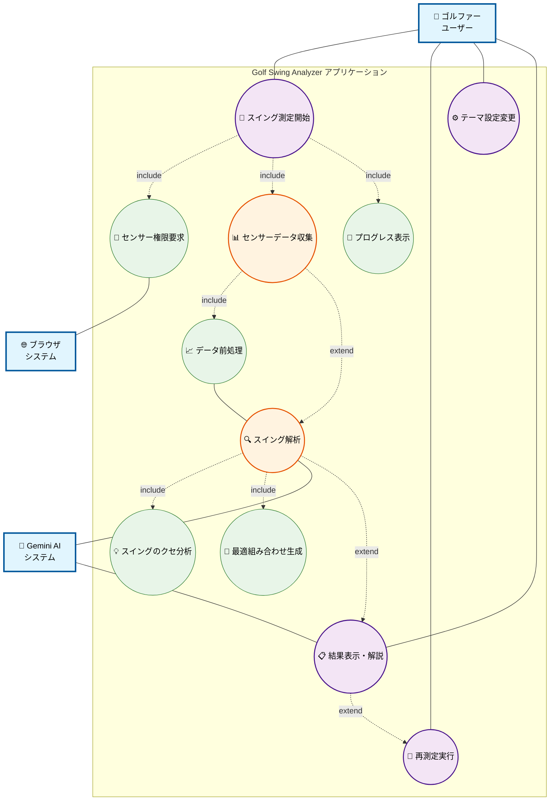

# ユースケース図

Golf Swing Analyzer アプリケーションのユースケース図

## ユースケース詳細

### 主要アクター

| アクター | 説明 | 責任 |
|---------|------|------|
| **ゴルファー（ユーザー）** | アプリを使用するゴルフプレイヤー | スイング実行、アプリ操作 |
| **Gemini AI システム** | Google の生成AI | スイングデータ解析、提案生成 |
| **ブラウザシステム** | Webブラウザ環境 | センサーアクセス、権限管理 |

### 主要ユースケース

#### 1. 📱 スイング測定開始
- **概要**: ユーザーがスイング測定を開始する
- **事前条件**: アプリにアクセス済み
- **基本フロー**: 
  1. 測定開始ボタンをタップ
  2. センサー権限を確認
  3. 測定準備完了を表示

#### 2. 📊 センサーデータ収集
- **概要**: デバイスのジャイロセンサーからスイングデータを収集
- **事前条件**: センサー権限が許可済み
- **基本フロー**:
  1. ジャイロセンサー・加速度センサーを起動
  2. スイング動作を検出
  3. データを100ms間隔で収集
  4. スイング終了を自動判定

#### 3. 🔍 スイング解析
- **概要**: 収集したデータをGemini AIで解析
- **事前条件**: センサーデータ収集完了
- **基本フロー**:
  1. データを前処理・正規化
  2. Gemini APIにデータ送信
  3. スイングのクセを分析
  4. 最適な組み合わせを生成

#### 4. 📋 結果表示・解説
- **概要**: 解析結果をユーザーに分かりやすく表示
- **事前条件**: AI解析完了
- **基本フロー**:
  1. 「あなたのクセは...」の解説表示
  2. 3つの推奨組み合わせをカード表示
  3. 各組み合わせの理由を表示

#### 5. 🔄 再測定実行
- **概要**: ユーザーが再度測定を行う
- **事前条件**: 結果表示完了
- **基本フロー**:
  1. 再測定ボタンをタップ
  2. 前回データをクリア
  3. 新しい測定を開始

### システム境界

このユースケース図は **Golf Swing Analyzer** アプリケーション内の機能に焦点を当てており、外部システム（ブラウザのセンサーAPI、Gemini AI）との連携も表現しています。
