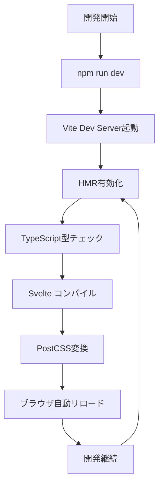
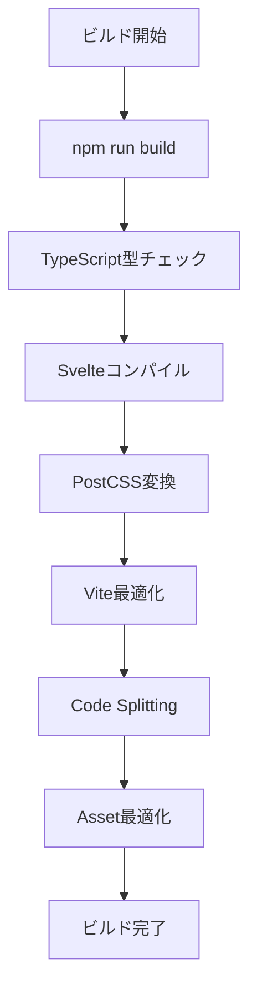

# ⚙️ Shunsaku プロジェクト技術仕様書

Material Design 3ベースのWebアプリケーション開発プロジェクトの技術スタックと仕様詳細

## 📖 目次

1. [プロジェクト概要](#プロジェクト概要)
2. [コア技術スタック](#コア技術スタック)
3. [フロントエンド技術](#フロントエンド技術)
4. [CSS・スタイリング技術](#cssスタイリング技術)
5. [開発環境・ツール](#開発環境ツール)
6. [アーキテクチャ・設計原則](#アーキテクチャ設計原則)
7. [ファイル構成・ディレクトリ構造](#ファイル構成ディレクトリ構造)
8. [パフォーマンス・最適化](#パフォーマンス最適化)
9. [アクセシビリティ対応](#アクセシビリティ対応)
10. [開発・ビルドプロセス](#開発ビルドプロセス)
11. [設定ファイル詳細](#設定ファイル詳細)
12. [依存関係管理](#依存関係管理)

---

## プロジェクト概要

### 基本情報
- **プロジェクト名**: Shunsaku
- **プロジェクトタイプ**: Material Design 3ベースのWebアプリケーション
- **開発アプローチ**: モダンフロントエンド、コンポーネント指向
- **対象ブラウザ**: モダンブラウザ (ES2020+対応)
- **デバイス対応**: レスポンシブ (Mobile First)

### プロジェクト特徴
- ✅ **Material Design 3準拠**のデザインシステム
- ✅ **7テーマシステム**による多様な用途対応
- ✅ **完全TypeScript**による型安全な開発
- ✅ **モダンCSS技術**によるパフォーマンス最適化
- ✅ **アクセシビリティ準拠** (WCAG 2.1 AA)

---

## コア技術スタック

### フレームワーク・ランタイム

| 技術 | バージョン | 役割 | 選定理由 |
|------|-----------|------|----------|
| **SvelteKit** | ^2.22.0 | フルスタックフレームワーク | 高速、軽量、優れたDX |
| **Svelte** | ^5.0.0 | UIフレームワーク | コンパイル時最適化、小さなバンドルサイズ |
| **TypeScript** | ^5.0.0 | 型システム | 型安全性、開発効率向上 |
| **Vite** | ^7.0.4 | ビルドツール | 高速HMR、ES Modules最適化 |
| **Node.js** | v24.3.0+ | ランタイム環境 | モダンJavaScript機能サポート |

### アダプター・デプロイ

| 技術 | バージョン | 用途 |
|------|-----------|------|
| **@sveltejs/adapter-auto** | ^6.0.0 | 自動デプロイ設定 |
| **@sveltejs/vite-plugin-svelte** | ^6.0.0 | Vite統合 |

---

## フロントエンド技術

### JavaScript・TypeScript

```typescript
// TypeScript設定 (tsconfig.json)
{
  "compilerOptions": {
    "target": "ES2020",
    "module": "ESNext",
    "moduleResolution": "bundler",
    "allowImportingTsExtensions": true,
    "resolveJsonModule": true,
    "allowJs": true,
    "checkJs": true,
    "isolatedModules": true,
    "strict": true
  }
}
```

### Svelte 5の新機能活用

| 機能 | 使用箇所 | メリット |
|------|---------|----------|
| **Runes ($state, $effect)** | テーマストア | リアクティブ状態管理の簡略化 |
| **Snippets** | レイアウトコンポーネント | 再利用可能なテンプレート片 |
| **New Props Syntax** | 全コンポーネント | 型安全なプロパティ定義 |

### 状態管理

```typescript
// Svelteストア使用
import { writable } from 'svelte/store';

// テーマ管理
export const themeStore = createThemeStore();

// 型定義
export type ThemeColor = 'default' | 'ocean' | 'sunset' | 'purple' | 'forest' | 'monochrome' | 'rose';
export type ThemeMode = 'auto' | 'light' | 'dark';
```

---

## CSS・スタイリング技術

### PostCSS エコシステム

| パッケージ | バージョン | 機能 | 設定 |
|-----------|-----------|------|------|
| **postcss** | ^8.5.6 | CSS変換エンジン | ベース |
| **autoprefixer** | ^10.4.21 | ベンダープレフィックス自動追加 | ブラウザサポート最適化 |
| **postcss-nesting** | 最新 | CSS入れ子記法 | Sassライクな記法 |

### PostCSS設定

```javascript
// postcss.config.js
const config = {
  plugins: {
    'postcss-nesting': {},    // CSS入れ子記法
    autoprefixer: {}          // ベンダープレフィックス
  }
};
```

### CSS技術仕様

| 技術 | 活用方法 | メリット |
|------|---------|----------|
| **CSS Custom Properties** | デザイントークン | 動的テーマ切り替え |
| **CSS Grid** | レスポンシブレイアウト | 柔軟なグリッドシステム |
| **CSS Flexbox** | コンポーネントレイアウト | 効率的な配置 |
| **CSS Logical Properties** | 国際化対応 | RTL/LTR対応 |
| **CSS Container Queries** | (将来対応) | コンテナベースレスポンシブ |

### フォント・アイコン

| リソース | 用途 | 読み込み方法 |
|---------|------|------------|
| **Noto Sans JP** | メインフォント | Google Fonts CDN |
| **Emoji** | アイコン代替 | Unicode絵文字 |

---

## 開発環境・ツール

### 開発サーバー・ビルド

| コマンド | 機能 | 技術 |
|---------|------|------|
| `npm run dev` | 開発サーバー起動 | Vite Dev Server |
| `npm run build` | プロダクションビルド | Vite Build |
| `npm run preview` | ビルド確認 | Vite Preview |

### 開発支援ツール

| ツール | 機能 | 設定ファイル |
|-------|------|------------|
| **svelte-check** | Svelte型チェック | tsconfig.json |
| **TypeScript** | 型チェック | tsconfig.json |
| **Vite HMR** | 高速リロード | vite.config.ts |

### パッケージ管理

```json
// package.json スクリプト
{
  "scripts": {
    "dev": "vite dev",
    "build": "vite build", 
    "preview": "vite preview",
    "check": "svelte-kit sync && svelte-check --tsconfig ./tsconfig.json",
    "check:watch": "svelte-kit sync && svelte-check --tsconfig ./tsconfig.json --watch"
  }
}
```

---

## アーキテクチャ・設計原則

### デザインシステムアーキテクチャ

```
Design System Architecture
├── Design Tokens (design-tokens.css)
│   ├── Color Primitives
│   ├── Typography Scale  
│   ├── Spacing System
│   └── Border Radius
├── Theme System (themes.css)
│   ├── 7 Color Themes
│   ├── Light/Dark Modes
│   └── Semantic Colors
├── Base Layer (base.css)
│   ├── CSS Reset
│   ├── Global Styles
│   └── Accessibility Base
├── Component Layer (components.css)
│   ├── Button Variants
│   ├── Card Components
│   ├── Form Elements
│   └── Navigation
└── Responsive Layer (responsive.css)
    ├── Breakpoint System
    ├── Responsive Utilities
    └── Adaptive Layouts
```

### Material Design 3準拠

| 仕様 | 実装方法 | ファイル |
|------|---------|----------|
| **Color System** | CSS Custom Properties | design-tokens.css |
| **Type Scale** | クラスベースシステム | components.css |
| **Motion** | CSS Transitions | components.css |
| **Elevation** | Box Shadow System | design-tokens.css |
| **Shape** | Border Radius Tokens | design-tokens.css |

### コンポーネント設計原則

1. **Single Responsibility** - 各コンポーネントは単一の責任
2. **Composition over Inheritance** - 継承より合成を優先
3. **Props Interface** - 明確なプロパティインターフェース
4. **Accessibility First** - アクセシビリティ組み込み設計
5. **Performance Optimized** - パフォーマンス最適化

---

## ファイル構成・ディレクトリ構造

### プロジェクト全体構造

```
shunsaku/
├── docs/                          # ドキュメント
│   ├── デザインシステム.md           # デザインシステム仕様
│   └── 技術仕様.md                 # 技術仕様書 (本文書)
├── src/
│   ├── app.html                   # HTMLテンプレート
│   ├── app.d.ts                   # アプリ型定義
│   ├── lib/                       # ライブラリ・共通コード
│   │   ├── components/            # 再利用可能コンポーネント
│   │   │   ├── ThemeSelector.svelte
│   │   │   └── ThemeDemo.svelte
│   │   ├── stores/                # 状態管理
│   │   │   └── theme.ts
│   │   ├── styles/                # スタイルシステム
│   │   │   ├── index.css          # エントリーポイント
│   │   │   ├── design-tokens.css  # デザイントークン
│   │   │   ├── themes.css         # テーマ定義
│   │   │   ├── base.css          # ベーススタイル
│   │   │   ├── components.css     # コンポーネントスタイル
│   │   │   └── responsive.css     # レスポンシブシステム
│   │   ├── assets/               # 静的アセット
│   │   └── index.ts              # ライブラリエクスポート
│   └── routes/                   # ページルーティング
│       ├── +layout.svelte        # グローバルレイアウト
│       ├── +page.svelte          # トップページ
│       └── internal/             # 内部ページ
│           └── design-demo/      # デザインシステムデモ
│               └── +page.svelte
├── static/                       # 静的ファイル
├── postcss.config.js            # PostCSS設定
├── vite.config.ts               # Vite設定
├── svelte.config.js             # Svelte設定
├── tsconfig.json                # TypeScript設定
├── package.json                 # 依存関係・スクリプト
└── package-lock.json            # 依存関係ロック
```

### CSS Architecture (ITCSS inspired)

```
CSS Layer Architecture
├── 1. Settings (design-tokens.css)
│   └── CSS Custom Properties
├── 2. Tools (PostCSS Plugins)
│   ├── Autoprefixer
│   └── Nesting
├── 3. Generic (base.css)
│   ├── CSS Reset
│   └── Box Sizing
├── 4. Elements (base.css)
│   ├── HTML Elements
│   └── Typography Base
├── 5. Objects (responsive.css)
│   ├── Layout Objects
│   └── Responsive Grid
├── 6. Components (components.css)
│   ├── Button Variants
│   ├── Card Components
│   └── Form Elements
└── 7. Utilities (components.css)
    ├── Spacing Utils
    ├── Color Utils
    └── Typography Utils
```

---

## パフォーマンス・最適化

### ビルド最適化

| 最適化技術 | 実装方法 | 効果 |
|-----------|---------|------|
| **Tree Shaking** | ES Modules + Vite | 未使用コード除去 |
| **Code Splitting** | SvelteKit自動分割 | 初期読み込み高速化 |
| **CSS Minification** | Vite自動圧縮 | CSSファイルサイズ削減 |
| **Asset Optimization** | Vite最適化 | フォント最適化 |

### CSS最適化

```css
/* Critical CSS インライン化 */
/* Above-the-fold スタイル優先読み込み */

/* CSS Custom Properties 活用 */
:root {
  --color-primary: #006d46;
  /* 計算コスト削減 */
}

/* CSS Logical Properties */
.component {
  margin-inline-start: var(--spacing-4);
  /* 国際化対応 + パフォーマンス */
}
```

### フォント最適化

```css
/* Google Fonts最適化読み込み */
@import url('https://fonts.googleapis.com/css2?family=Noto+Sans+JP:wght@100;200;300;400;500;600;700;800;900&display=swap');

/* font-display: swap 自動適用 */
/* フォント読み込み中の FOUT 対策 */
```

### JavaScript最適化

```typescript
// 遅延読み込み
const loadThemeSelector = () => import('$lib/components/ThemeSelector.svelte');

// 型安全な動的インポート
type ThemeComponent = typeof import('$lib/components/ThemeSelector.svelte').default;
```

---

## アクセシビリティ対応

### WCAG 2.1 AA準拠

| 項目 | 実装方法 | 技術 |
|------|---------|------|
| **カラーコントラスト** | 4.5:1以上確保 | CSS Color Values |
| **キーボードナビゲーション** | Tab順序・フォーカス管理 | CSS :focus-visible |
| **スクリーンリーダー** | セマンティックHTML・ARIA | HTML5 + ARIA |
| **モーション軽減** | prefers-reduced-motion | CSS Media Queries |

### アクセシビリティ技術実装

```css
/* 高コントラストモード対応 */
@media (prefers-contrast: high) {
  :root {
    --color-primary: #000000;
    --color-on-primary: #ffffff;
  }
}

/* モーション軽減設定 */
@media (prefers-reduced-motion: reduce) {
  *,
  *::before,
  *::after {
    animation-duration: 0.01ms !important;
    transition-duration: 0.01ms !important;
  }
}

/* フォーカススタイル */
:focus-visible {
  outline: 2px solid var(--color-primary);
  outline-offset: 2px;
}
```

### セマンティックHTML

```html
<!-- 適切なHTML5セマンティクス -->
<main role="main">
  <section aria-labelledby="section-title">
    <h2 id="section-title">セクションタイトル</h2>
  </section>
</main>

<!-- フォームアクセシビリティ -->
<label for="input-id" class="form-label">ラベル</label>
<input type="text" id="input-id" aria-describedby="help-text" />
<div id="help-text" class="help-text">ヘルプテキスト</div>
```

---

## 開発・ビルドプロセス

### 開発フロー



### ビルドプロセス



### 品質保証プロセス

| ステップ | ツール | 確認項目 |
|---------|-------|----------|
| **型チェック** | TypeScript | 型安全性 |
| **Lint** | svelte-check | コード品質 |
| **アクセシビリティ** | Svelte a11y | WCAG準拠 |
| **パフォーマンス** | Vite Bundle Analyzer | バンドルサイズ |

---

## 設定ファイル詳細

### Vite設定 (vite.config.ts)

```typescript
import { sveltekit } from '@sveltejs/kit/vite';
import { defineConfig } from 'vite';

export default defineConfig({
  plugins: [sveltekit()],
  css: {
    postcss: './postcss.config.js'
  },
  build: {
    target: 'es2020',
    cssCodeSplit: true,
    rollupOptions: {
      output: {
        manualChunks: {
          // チャンク分割最適化
        }
      }
    }
  }
});
```

### Svelte設定 (svelte.config.js)

```javascript
import adapter from '@sveltejs/adapter-auto';
import { vitePreprocess } from '@sveltejs/vite-plugin-svelte';

const config = {
  preprocess: vitePreprocess(),
  kit: {
    adapter: adapter()
  }
};

export default config;
```

### TypeScript設定 (tsconfig.json)

```json
{
  "extends": "./.svelte-kit/tsconfig.json",
  "compilerOptions": {
    "allowJs": true,
    "checkJs": true,
    "esModuleInterop": true,
    "forceConsistentCasingInFileNames": true,
    "resolveJsonModule": true,
    "skipLibCheck": true,
    "sourceMap": true,
    "strict": true,
    "moduleResolution": "bundler"
  }
}
```

---

## 依存関係管理

### プロダクション依存関係

| パッケージ | 用途 | 重要度 |
|-----------|------|--------|
| なし | 全て開発依存関係 | - |

### 開発依存関係

| パッケージ | バージョン | 用途 | 更新頻度 |
|-----------|-----------|------|----------|
| `@sveltejs/adapter-auto` | ^6.0.0 | デプロイアダプター | 中 |
| `@sveltejs/kit` | ^2.22.0 | フレームワーク | 高 |
| `@sveltejs/vite-plugin-svelte` | ^6.0.0 | Vite統合 | 中 |
| `autoprefixer` | ^10.4.21 | CSS最適化 | 低 |
| `postcss` | ^8.5.6 | CSS変換 | 低 |
| `postcss-nesting` | 最新 | CSS入れ子 | 低 |
| `svelte` | ^5.0.0 | UIフレームワーク | 高 |
| `svelte-check` | ^4.0.0 | 型チェック | 中 |
| `typescript` | ^5.0.0 | 型システム | 中 |
| `vite` | ^7.0.4 | ビルドツール | 中 |

### セキュリティ・メンテナンス

```bash
# 依存関係の脆弱性チェック
npm audit

# パッケージ更新確認
npm outdated

# 自動更新 (慎重に)
npm update
```

---

## パフォーマンス指標

### 現在の実装状況

| 機能 | 実装状況 | 技術 |
|------|---------|------|
| **Tree Shaking** | ✅ 実装済み | Vite + ES Modules |
| **CSS Minification** | ✅ 実装済み | Vite自動圧縮 |
| **Code Splitting** | ✅ 実装済み | SvelteKit自動分割 |
| **Responsive Design** | ✅ 実装済み | CSS Grid + Flexbox |
| **Theme System** | ✅ 実装済み | CSS Custom Properties |

### 実装済み最適化

- ✅ **Tree Shaking** - 未使用コード自動除去
- ✅ **CSS Minification** - CSS圧縮
- ✅ **Font Optimization** - Webフォント最適化
- ✅ **Code Splitting** - 動的インポート
- ✅ **Caching Strategy** - ブラウザキャッシュ最適化

---

## 開発環境要件

### 必要なソフトウェア

| ソフトウェア | 最小バージョン | 推奨バージョン | 用途 |
|-------------|--------------|-------------|------|
| **Node.js** | 18.0.0 | 20.0.0+ | JavaScript実行環境 |
| **npm** | 8.0.0 | 9.0.0+ | パッケージ管理 |
| **Git** | 2.0.0 | 最新 | バージョン管理 |

### 推奨開発環境

| ツール | 用途 | 設定 |
|-------|------|------|
| **VS Code** | エディタ | Svelte拡張推奨 |
| **Chrome DevTools** | デバッグ | Lighthouse有効化 |
| **Figma** | デザイン | Material Design 3プラグイン |

### 環境固有設定

```bash
# Node.js バージョン管理 (.nvmrc)
node --version > .nvmrc

# 環境変数設定 (.env)
NODE_ENV=development
VITE_API_URL=http://localhost:5173
```

---

## トラブルシューティング

### よくある問題

| 問題 | 原因 | 解決方法 |
|------|------|----------|
| **HMRが動作しない** | Vite設定 | vite.config.ts確認 |
| **型エラー** | TypeScript設定 | svelte-check実行 |
| **CSSが適用されない** | PostCSS設定 | postcss.config.js確認 |
| **テーマが切り替わらない** | ストア初期化 | ブラウザキャッシュクリア |

### デバッグコマンド

```bash
# 型チェック
npm run check

# 開発サーバー再起動
npm run dev --force

# キャッシュクリア
rm -rf .svelte-kit node_modules
npm install
```

---

## 参考リソース

### 公式ドキュメント

- [SvelteKit Documentation](https://kit.svelte.dev/)
- [Svelte 5 Documentation](https://svelte.dev/)
- [Material Design 3](https://m3.material.io/)
- [PostCSS Documentation](https://postcss.org/)
- [Vite Documentation](https://vitejs.dev/)

### 技術仕様

- [Web Content Accessibility Guidelines (WCAG) 2.1](https://www.w3.org/WAI/WCAG21/quickref/)
- [CSS Logical Properties](https://developer.mozilla.org/en-US/docs/Web/CSS/CSS_Logical_Properties)
- [TypeScript Handbook](https://www.typescriptlang.org/docs/)
