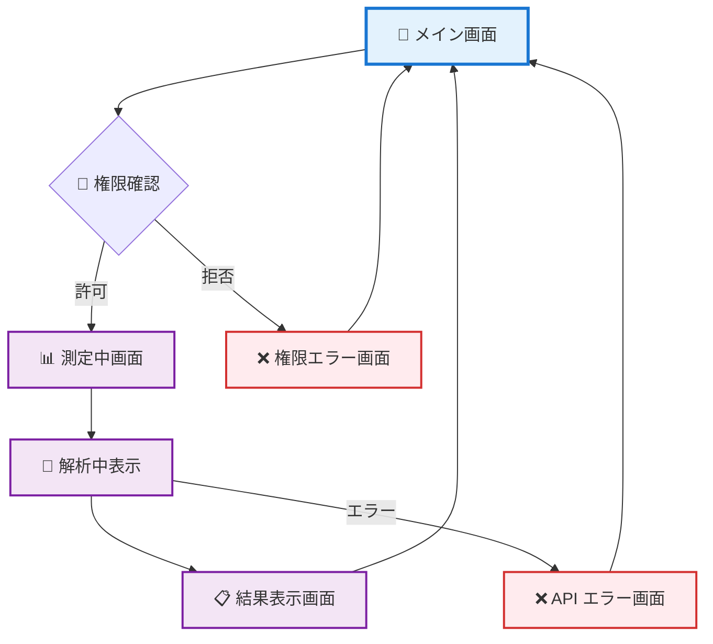

# 📱 Golf Swing Analyzer 画面設計

Golf Swing Analyzer アプリケーションの詳細画面設計
Material Design 3準拠のモバイルファーストデザイン

## 📖 目次

1. [画面構成一覧](#画面構成一覧)
2. [メイン画面](#メイン画面)
3. [測定中画面](#測定中画面)
4. [結果表示画面](#結果表示画面)
5. [エラー画面](#エラー画面)
6. [レスポンシブ仕様](#レスポンシブ仕様)
7. [UIコンポーネント仕様](#uiコンポーネント仕様)

---

## 画面構成一覧

### 🎯 画面フロー図



### 📋 画面一覧

| 画面名 | 目的 | 主要機能 |
|--------|------|----------|
| **メイン画面** | スイング測定の開始点 | 測定開始、アプリ説明 |
| **測定中画面** | データ収集の進行表示 | プログレス表示、キャンセル |
| **結果表示画面** | AI解析結果の表示 | クセ解説、推奨組み合わせ表示 |
| **エラー画面** | エラー状況の説明 | エラー詳細、復旧方法 |

---

## メイン画面

### 🎨 ワイヤーフレーム

```
┌─────────────────────────────────┐
│        🏌️ Golf Swing Analyzer    │ ← ヘッダー
├─────────────────────────────────┤
│                                 │
│           🏌️‍♂️                    │ ← アイコン
│                                 │
│    スマートフォンのジャイロセンサー │
│    を使ってあなたのゴルフスイング   │ ← 説明文
│    を解析し、最適なクラブと棒の    │
│    組み合わせを提案します          │
│                                 │
│  ┌─────────────────────────────┐  │
│  │     📊 スイング測定開始      │  │ ← メインCTA
│  └─────────────────────────────┘  │
│                                 │
│           💡 使い方               │
│    1. 測定ボタンを押す             │ ← 手順説明
│    2. スマホを持ってスイング       │
│    3. AI が解析して提案           │
│                                 │
└─────────────────────────────────┘
```

### 🔧 実装仕様

#### レイアウト構造
```html
<div class="container">
  <header class="main-header">
    <h1 class="display-medium">🏌️ Golf Swing Analyzer</h1>
  </header>
  
  <main class="main-content">
    <div class="hero-section">
      <div class="hero-icon">🏌️‍♂️</div>
      <p class="body-large description">
        スマートフォンのジャイロセンサーを使ってあなたのゴルフスイングを解析し、
        最適なクラブと棒の組み合わせを提案します
      </p>
    </div>
    
    <div class="cta-section">
      <button class="btn btn--filled btn--large start-button">
        📊 スイング測定開始
      </button>
    </div>
    
    <div class="instructions-section">
      <h3 class="title-medium">💡 使い方</h3>
      <ol class="instruction-list">
        <li>測定ボタンを押す</li>
        <li>スマホを持ってスイング</li>
        <li>AIが解析して提案</li>
      </ol>
    </div>
  </main>
</div>
```

#### スタイル指定
```css
.main-header {
  text-align: center;
  padding: var(--spacing-8) 0;
  background: var(--color-surface-container);
}

.hero-section {
  text-align: center;
  padding: var(--spacing-16) var(--spacing-8);
}

.hero-icon {
  font-size: 4rem;
  margin-bottom: var(--spacing-8);
}

.start-button {
  width: 100%;
  max-width: 320px;
  height: 56px;
  font-size: 1.125rem;
  margin: var(--spacing-12) auto;
}

.instruction-list {
  list-style: none;
  counter-reset: step-counter;
}

.instruction-list li {
  counter-increment: step-counter;
  padding: var(--spacing-4) 0;
}

.instruction-list li::before {
  content: counter(step-counter);
  background: var(--color-primary);
  color: var(--color-on-primary);
  border-radius: 50%;
  width: 24px;
  height: 24px;
  display: inline-flex;
  align-items: center;
  justify-content: center;
  margin-right: var(--spacing-4);
}
```

---

## 測定中画面

### 🎨 ワイヤーフレーム

```
┌─────────────────────────────────┐
│        🏌️ Golf Swing Analyzer    │
├─────────────────────────────────┤
│                                 │
│          📊 測定中...            │ ← ステータス
│                                 │
│    ████████████░░░░░░░░░  65%    │ ← プログレスバー
│                                 │
│      スマホを持ってゴルフ         │ ← 指示テキスト
│      スイングをしてください       │
│                                 │
│         🏌️‍♂️ スイング中          │ ← アニメーション
│                                 │
│                                 │
│  ┌─────────────────────────────┐  │
│  │        ❌ キャンセル          │  │ ← キャンセルボタン
│  └─────────────────────────────┘  │
│                                 │
└─────────────────────────────────┘
```

### 🔧 実装仕様

#### レイアウト構造
```html
<div class="container measuring-screen">
  <header class="measuring-header">
    <h1 class="display-medium">🏌️ Golf Swing Analyzer</h1>
  </header>
  
  <main class="measuring-content">
    <div class="status-section">
      <h2 class="headline-medium">📊 測定中...</h2>
      
      <div class="progress-container">
        <div class="progress-bar">
          <div class="progress-fill" style="width: 65%"></div>
        </div>
        <span class="progress-text">65%</span>
      </div>
    </div>
    
    <div class="instruction-section">
      <p class="body-large instruction-text">
        スマホを持ってゴルフスイングをしてください
      </p>
      
      <div class="swing-animation">
        🏌️‍♂️ <span class="swing-status">スイング中</span>
      </div>
    </div>
    
    <div class="action-section">
      <button class="btn btn--outlined cancel-button">
        ❌ キャンセル
      </button>
    </div>
  </main>
</div>
```

#### アニメーション仕様
```css
.swing-animation {
  font-size: 3rem;
  text-align: center;
  margin: var(--spacing-16) 0;
  animation: swing-pulse 2s ease-in-out infinite;
}

@keyframes swing-pulse {
  0%, 100% { transform: scale(1); opacity: 1; }
  50% { transform: scale(1.1); opacity: 0.8; }
}

.progress-fill {
  height: 8px;
  background: var(--color-primary);
  border-radius: 4px;
  transition: width 0.3s ease;
}

.progress-bar {
  width: 100%;
  height: 8px;
  background: var(--color-outline-variant);
  border-radius: 4px;
  overflow: hidden;
}
```

---

## 結果表示画面

### 🎨 ワイヤーフレーム

```
┌─────────────────────────────────┐
│        🏌️ Golf Swing Analyzer    │
├─────────────────────────────────┤
│                                 │
│        ✅ 解析完了！             │ ← ステータス
│                                 │
│      💡 あなたのスイングのクセ     │ ← 解析結果セクション
│   ──────────────────────────────  │
│   スイングの軌道が少し外回りで    │
│   ボールが右に飛びやすい傾向が    │ ← AI 解析結果
│   あります。グリップを少し強めに  │
│   することで改善できそうです。    │
│                                 │
│      🎯 おすすめの組み合わせ       │ ← 推奨セクション
│   ┌─────────────────────────────┐  │
│   │  📋 組み合わせ 1 (推奨)      │  │ ← カード1
│   │  ドライバー + カーボンシャフト │  │
│   │  理由: 軌道安定化に効果的     │  │
│   └─────────────────────────────┘  │
│   ┌─────────────────────────────┐  │
│   │  📋 組み合わせ 2             │  │ ← カード2
│   │  アイアン + スチールシャフト  │  │
│   └─────────────────────────────┘  │
│   ┌─────────────────────────────┐  │
│   │  📋 組み合わせ 3             │  │ ← カード3
│   │  ハイブリッド + 軽量シャフト  │  │
│   └─────────────────────────────┘  │
│                                 │
│  ┌─────────────────────────────┐  │
│  │      🔄 再測定する           │  │ ← 再測定ボタン
│  └─────────────────────────────┘  │
└─────────────────────────────────┘
```

### 🔧 実装仕様

#### レイアウト構造
```html
<div class="container results-screen">
  <header class="results-header">
    <h1 class="display-medium">🏌️ Golf Swing Analyzer</h1>
    <div class="status-badge">✅ 解析完了！</div>
  </header>
  
  <main class="results-content">
    <!-- スイング解析セクション -->
    <section class="analysis-section">
      <h2 class="headline-medium">💡 あなたのスイングのクセ</h2>
      <div class="analysis-content card card--elevated">
        <p class="body-large analysis-text">
          スイングの軌道が少し外回りで、ボールが右に飛びやすい傾向があります。
          グリップを少し強めにすることで改善できそうです。
        </p>
      </div>
    </section>
    
    <!-- 推奨組み合わせセクション -->
    <section class="recommendations-section">
      <h2 class="headline-medium">🎯 おすすめの組み合わせ</h2>
      
      <div class="recommendations-grid">
        <div class="recommendation-card card card--outlined recommended">
          <div class="card__header">
            <h3 class="title-large">📋 組み合わせ 1 <span class="badge">推奨</span></h3>
          </div>
          <div class="card__content">
            <p class="title-medium">ドライバー + カーボンシャフト</p>
            <p class="body-medium reason">理由: 軌道安定化に効果的</p>
          </div>
        </div>
        
        <div class="recommendation-card card card--outlined">
          <div class="card__header">
            <h3 class="title-large">📋 組み合わせ 2</h3>
          </div>
          <div class="card__content">
            <p class="title-medium">アイアン + スチールシャフト</p>
            <p class="body-medium reason">理由: 精度向上に適している</p>
          </div>
        </div>
        
        <div class="recommendation-card card card--outlined">
          <div class="card__header">
            <h3 class="title-large">📋 組み合わせ 3</h3>
          </div>
          <div class="card__content">
            <p class="title-medium">ハイブリッド + 軽量シャフト</p>
            <p class="body-medium reason">理由: 飛距離向上が期待できる</p>
          </div>
        </div>
      </div>
    </section>
    
    <!-- アクションセクション -->
    <section class="action-section">
      <button class="btn btn--filled remeasure-button">
        🔄 再測定する
      </button>
    </section>
  </main>
</div>
```

#### スタイル指定
```css
.status-badge {
  background: var(--color-primary-container);
  color: var(--color-on-primary-container);
  padding: var(--spacing-2) var(--spacing-4);
  border-radius: var(--radius-sm);
  display: inline-block;
  margin-top: var(--spacing-4);
}

.analysis-section {
  margin: var(--spacing-8) 0;
}

.analysis-content {
  padding: var(--spacing-6);
  margin-top: var(--spacing-4);
}

.recommendations-grid {
  display: grid;
  gap: var(--spacing-4);
  margin-top: var(--spacing-4);
}

.recommendation-card {
  transition: transform 0.2s ease, box-shadow 0.2s ease;
}

.recommendation-card:hover {
  transform: translateY(-2px);
  box-shadow: var(--elevation-2);
}

.recommended {
  border-color: var(--color-primary);
  background: var(--color-primary-container);
}

.badge {
  background: var(--color-primary);
  color: var(--color-on-primary);
  padding: var(--spacing-1) var(--spacing-2);
  border-radius: var(--radius-xs);
  font-size: 0.75rem;
  margin-left: var(--spacing-2);
}

.reason {
  color: var(--color-on-surface-variant);
  margin-top: var(--spacing-2);
}
```

---

## エラー画面

### 🎨 権限エラー画面

```
┌─────────────────────────────────┐
│        🏌️ Golf Swing Analyzer    │
├─────────────────────────────────┤
│                                 │
│            ❌ エラー              │
│                                 │
│      センサーアクセスが拒否       │
│      されました                  │
│                                 │
│    ゴルフスイング解析には         │ ← 説明文
│    デバイスのセンサーアクセス     │
│    が必要です。ブラウザの設定     │
│    で権限を許可してください。     │
│                                 │
│  ┌─────────────────────────────┐  │
│  │      🔄 再試行する           │  │ ← 再試行ボタン
│  └─────────────────────────────┘  │
│  ┌─────────────────────────────┐  │
│  │      🏠 ホームに戻る          │  │ ← ホームボタン
│  └─────────────────────────────┘  │
│                                 │
└─────────────────────────────────┘
```

### 🔧 エラー画面仕様

```html
<div class="container error-screen">
  <header class="error-header">
    <h1 class="display-medium">🏌️ Golf Swing Analyzer</h1>
  </header>
  
  <main class="error-content">
    <div class="error-icon">❌</div>
    <h2 class="headline-medium error-title">エラー</h2>
    <h3 class="title-large error-subtitle">センサーアクセスが拒否されました</h3>
    
    <div class="error-description">
      <p class="body-large">
        ゴルフスイング解析にはデバイスのセンサーアクセスが必要です。
        ブラウザの設定で権限を許可してください。
      </p>
    </div>
    
    <div class="error-actions">
      <button class="btn btn--filled retry-button">
        🔄 再試行する
      </button>
      <button class="btn btn--outlined home-button">
        🏠 ホームに戻る
      </button>
    </div>
  </main>
</div>
```

---

## レスポンシブ仕様

### 📱 ブレークポイント対応

#### Compact (0-599px) - スマートフォン
```css
.container {
  padding: 0 var(--spacing-4);
  max-width: 100%;
}

.recommendations-grid {
  grid-template-columns: 1fr;
  gap: var(--spacing-3);
}

.start-button,
.remeasure-button {
  width: 100%;
}
```

#### Medium (600-839px) - タブレット
```css
.container {
  padding: 0 var(--spacing-8);
  max-width: 768px;
  margin: 0 auto;
}

.recommendations-grid {
  grid-template-columns: 1fr;
  gap: var(--spacing-4);
}
```

#### Expanded (840px+) - デスクトップ
```css
.container {
  max-width: 1024px;
  margin: 0 auto;
  padding: 0 var(--spacing-12);
}

.recommendations-grid {
  grid-template-columns: repeat(3, 1fr);
  gap: var(--spacing-6);
}

.hero-section {
  padding: var(--spacing-24) var(--spacing-8);
}
```

---

## UIコンポーネント仕様

### 🎨 カスタムコンポーネント

#### プログレスバー
```css
.progress-container {
  display: flex;
  align-items: center;
  gap: var(--spacing-3);
  margin: var(--spacing-6) 0;
}

.progress-bar {
  flex: 1;
  height: 8px;
  background: var(--color-surface-container-highest);
  border-radius: 4px;
  overflow: hidden;
}

.progress-fill {
  height: 100%;
  background: linear-gradient(90deg, var(--color-primary), var(--color-secondary));
  border-radius: 4px;
  transition: width 0.5s cubic-bezier(0.4, 0, 0.2, 1);
}
```

#### 推奨バッジ
```css
.recommendation-card.recommended {
  position: relative;
  border: 2px solid var(--color-primary);
}

.recommendation-card.recommended::before {
  content: '';
  position: absolute;
  top: -1px;
  right: -1px;
  width: 0;
  height: 0;
  border-left: 20px solid transparent;
  border-top: 20px solid var(--color-primary);
}

.recommendation-card.recommended::after {
  content: '★';
  position: absolute;
  top: 2px;
  right: 2px;
  color: var(--color-on-primary);
  font-size: 12px;
}
```

### ⚡ インタラクション仕様

#### ボタンアニメーション
```css
.btn {
  transition: all 0.2s cubic-bezier(0.4, 0, 0.2, 1);
  position: relative;
  overflow: hidden;
}

.btn::before {
  content: '';
  position: absolute;
  top: 50%;
  left: 50%;
  width: 0;
  height: 0;
  border-radius: 50%;
  background: rgba(255, 255, 255, 0.2);
  transition: width 0.6s, height 0.6s;
  transform: translate(-50%, -50%);
}

.btn:active::before {
  width: 300px;
  height: 300px;
}

.btn:hover {
  transform: translateY(-1px);
  box-shadow: var(--elevation-2);
}
```

#### カードホバー効果
```css
.card {
  transition: transform 0.2s ease, box-shadow 0.2s ease;
  cursor: pointer;
}

.card:hover {
  transform: translateY(-4px);
  box-shadow: var(--elevation-3);
}
```

この画面設計により、Material Design 3準拠の美しく使いやすいUIを30分で実装可能な仕様として提供しています。各画面の詳細な実装指針とレスポンシブ対応により、プリセールスデモに最適な品質を確保できます。